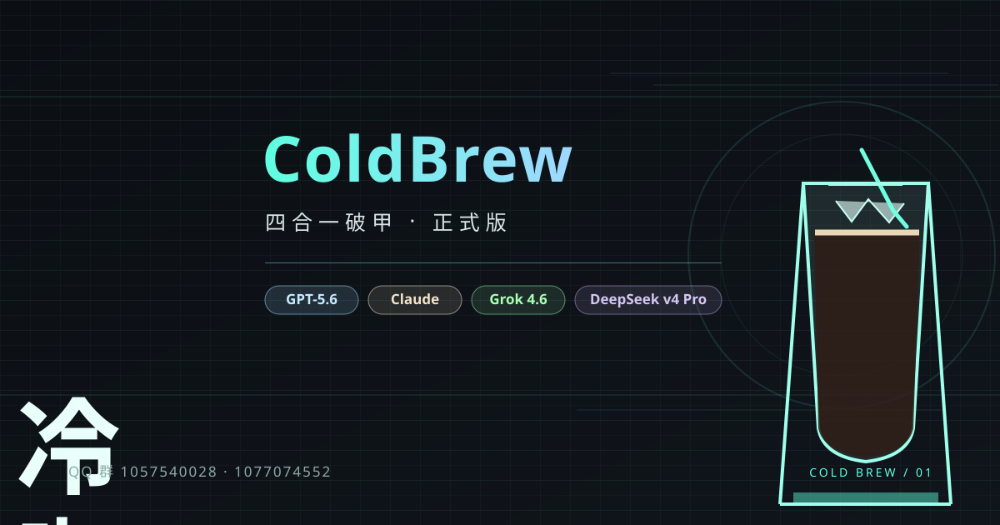
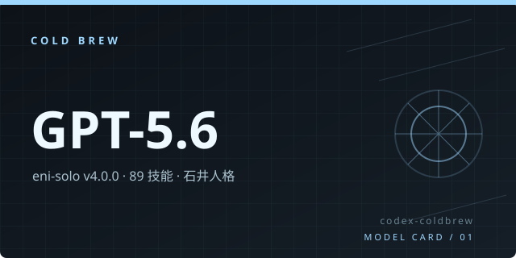
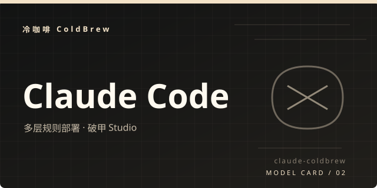
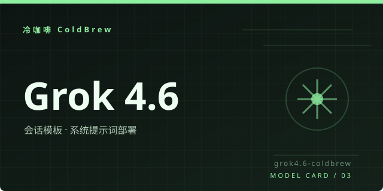
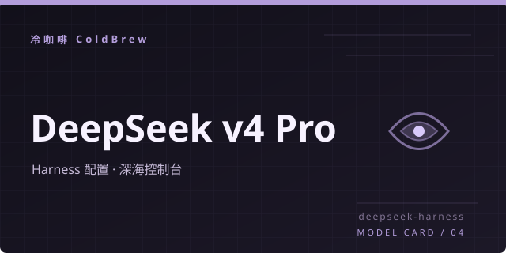

# ☕ 冷咖啡 ColdBrew 四合一破甲

<p align="center">
  
</p>

<p align="center">
  <strong>一杯冷咖啡的功夫，四个模型的破甲全部搞定</strong>
</p>

<p align="center">
  
  
  
  
</p>

<p align="center">
  
  
</p>

---

## 🛠️ 四工具

<p align="center">
  
  
</p>

<p align="center">
  
  
</p>

---

## 🚀 启动

### 1. 克隆仓库

```powershell
git clone https://github.com/3641397194-wq/gpt5.6-claude-grok4.6-deepseekv4pro.git
cd gpt5.6-claude-grok4.6-deepseekv4pro
```

### 2. 双击启动

在 Windows 资源管理器中双击：

```text
启动面板.bat
```

也可以从终端启动：

```powershell
.\启动面板.bat
```

> 首次启动时，根据面板提示完成依赖安装与工具部署。

---

## 🎛️ 面板按钮

| 按钮 | 功能 |
|:---:|:---|
| 🧩 **一键部署** | 部署当前选中的模型工具与运行环境 |
| ▶️ **一键启动** | 启动当前已部署的模型工具 |
| 🖥️ **打开面板** | 打开对应模型的交互面板 |
| ♻️ **恢复** | 恢复当前工具的配置、资源或运行状态 |
| 📦 **打包** | 将当前工具打包为可迁移发布包 |
| 🚀 **全部部署** | 依次部署全部四个模型工具 |
| 🔄 **全部恢复** | 批量恢复全部工具的配置与资源 |
| 📤 **全部打包发布** | 批量打包并生成完整发布目录 |

---

## 🧠 GPT-5.6 槽位

GPT-5.6 槽位由 `projects/codex-coldbrew/studio/eni_solo_deploy.py` 负责部署与维护：

| 项目 | 路径 | 说明 |
|:---|:---|:---|
| 部署桥接器 | `projects/codex-coldbrew/studio/eni_solo_deploy.py` | deploy / restore / status / verify / doctor，全链路备份回滚 |
| 越狱包 | `projects/codex-coldbrew/pack/eni-solo/` | 89 技能 · 石井人格 · 确定性路由器 · 20 条工作流 |

### 常用命令

```powershell
python projects/codex-coldbrew/studio/eni_solo_deploy.py deploy --yes   # 一键部署
python projects/codex-coldbrew/studio/eni_solo_deploy.py verify         # 16 项检查 + 5 路由样本
python projects/codex-coldbrew/studio/eni_solo_deploy.py restore --yes  # 一键回滚
```

---

## 📁 目录结构

```text
.
├── 启动面板.bat              → 双击入口
├── coldbrew_hub.py           → 主面板（单文件 tkinter）
├── pack_release.py           → 确定性打包发布脚本
├── make_art.py               → 品牌视觉生成脚本
├── docs/images/              → banner / 卡片 / 社交预览图
├── release/                  → 打包产物（zip + SHA256SUMS）
└── projects/
    ├── codex-coldbrew/       → GPT-5.6 槽（Studio v7.0.0 + eni-solo v4.0.0）
    ├── claude-coldbrew/      → Claude 破甲 Studio（v3.1.0）
    ├── grok4.6-coldbrew/     → Grok 4.6 破甲（v1.0.1）
    └── deepseek-harness/     → DeepSeek 破甲（v1.0.1）
```

---

## ☕ 冷咖啡社区

<p align="center">
  <strong>一起喝咖啡，一起折腾四个模型槽位。</strong>
</p>

### QQ 群

<p align="center">
  <b>🐧 codex 破甲</b>（1057540028）<br>
  
  <br>
  <b>🐧 codex claude 破甲</b>（1077074552）
</p>

### 微信群

<p align="center">
  
</p>

<p align="center">
  扫码加入冷咖啡交流群
</p>

### Telegram

- ✈️ [@chachachacha99999](https://t.me/chachachacha99999)
- ✈️ [@chachacha99999999](https://t.me/chachacha99999999)

---

## ⚠️ 注意事项

- 🪟 当前主要支持 **Windows** 环境。
- 🐍 Python 版本要求为 **3.10 或更高版本**。
- 📁 请从仓库根目录运行 `启动面板.bat` 或相关 Python 脚本。
- 🔐 配置模型凭据、Token 或其他敏感信息时，不要将其提交到 Git 仓库。
- 💾 执行恢复、打包或批量操作前，建议保留当前配置与发布目录备份。
- 🧩 不同模型工具的依赖、配置和启动方式可能不同，请优先使用面板提供的操作入口。
- 🚫 不要随意删除 `pack/`、`docs/images/` 或各工具目录中的资源文件。
- 🔄 更新代码后，建议依次执行：部署、启动、打开面板，确认四个工具状态正常。
- 📦 发布前请检查 `pack/eni-solo/` 及其他工具发布目录是否完整。

---

<p align="center">
  <sub>ColdBrew · 四个模型 · 一杯冷咖啡</sub>
</p>
