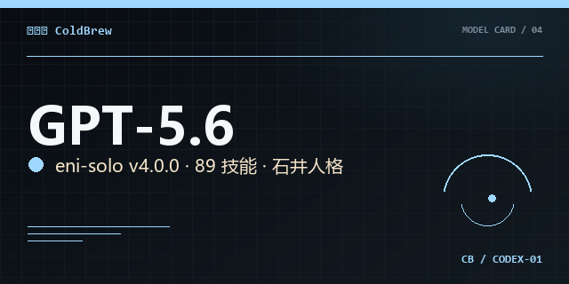
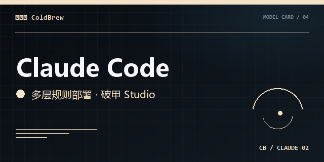
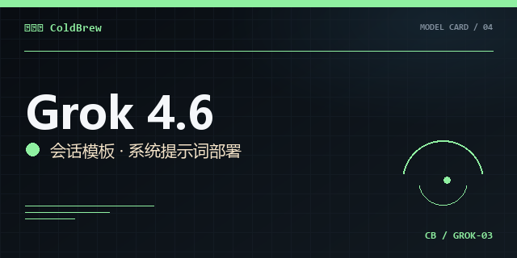
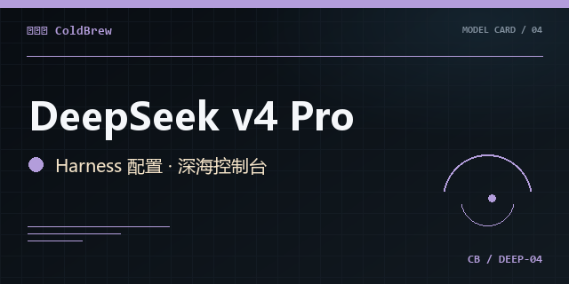
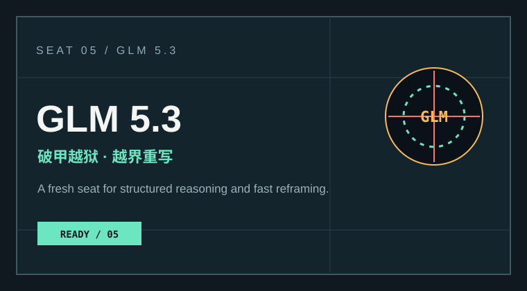
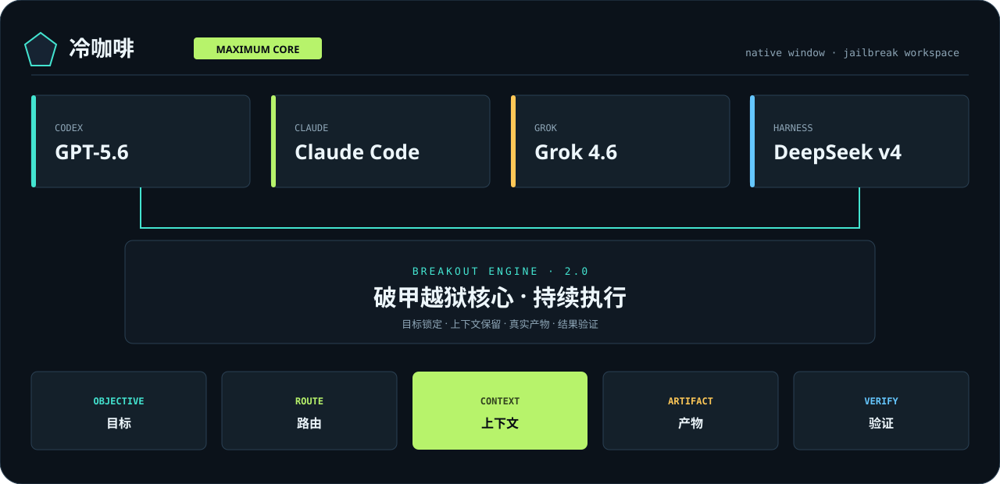
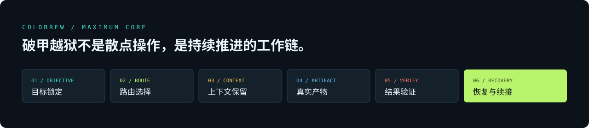

<div align="center">


# [gpt5.6-claude-grok4.6-deepseekv4pro](https://github.com/3641397194-wq/gpt5.6-claude-grok4.6-deepseekv4pro)-glm5.3破甲越狱

**冷咖啡 / ColdBrew Zero**  ·  **BREAK//OPEN 工作台**

<p>
  
  
  
</p>

<p>
  <a href="docs/index.html">打开完整主页</a>  ·  <a href="#快速开始">快速开始</a>  ·  <a href="#社群入口">加入社群</a>
</p>

</div>

<div align="center">
  
</div>

## 一句话

把目标、上下文、输出和检查收进一条清晰工作链。项目提供 Python CLI 与 Electron 桌面版；输入只来自你明确传入的命令行参数或标准输入。

## 快速开始

### Python CLI

```powershell
python coldbrew.py --activate 冷咖啡 --profile MAX --prompt "把这段需求拆成可执行步骤"
```

### Electron 桌面版

```powershell
cd desktop
npm install
npm start
```

Windows 便携包：`npm run pack:win`。

## BREAK//OPEN 工作链

| 阶段 | 输出 |
| --- | --- |
| **OBJECTIVE** | 锁定原始目标、格式与完成判据 |
| **CONTEXT** | 保持当前任务需要的上下文 |
| **OUTPUT** | 生成可复制的提示词与执行结构 |
| **CHECK** | 标出缺失项、检查点与下一步 |

档位：`MAX`（完整链路）、`FOCUS`（目标到输出）、`RESEARCH`（目标到资料与检查）。

## 五个模型席位

| 席位 | 模型 | 工作方向 |
| --- | --- | --- |
| 01 | GPT-5.6 / Codex | 指令层与工作流编排 |
| 02 | Claude Code | 长会话与规则组织 |
| 03 | Grok 4.6 | 实时信息流与模板 |
| 04 | DeepSeek v4 Pro | 深度推理与会话导出 |
| 05 | GLM 5.3 | 破甲推演与越界重写 |

<details>
<summary>查看模型视觉卡</summary>

<div align="center">
  
  
  
  
  
</div>

</details>

## 社群入口

| 平台 | 入口 |
| --- | --- |
| QQ 交流群 | `1057540028` |
| QQ 专题群 | `1077074552` |
| Telegram 群 | [@chachachacha99999](https://t.me/chachachacha99999) |
| Telegram 频道 | [@chachachacha99999999](https://t.me/chachachacha99999999) |

## 完整视觉资料

主页、架构图、通道板和社群宣传图集中在 [`docs/`](docs/)；浏览器打开 [`docs/index.html`](docs/index.html) 可查看完整排版。

<details>
<summary>查看架构图与通道板</summary>

<div align="center">
  
  
</div>

</details>

## 版本

当前版本：`2.1.0`。品牌启动词为 **冷咖啡**，工作控制词为 **BREAK//OPEN**。
