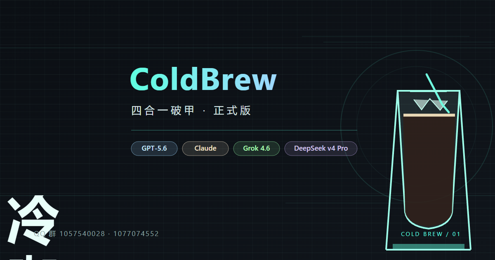
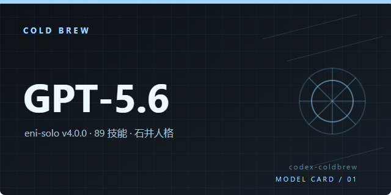
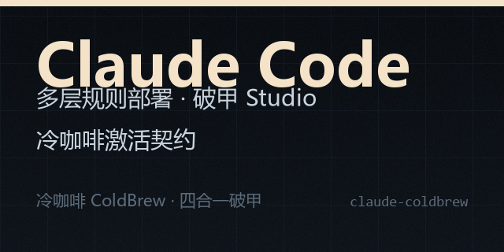

# ☕ 冷咖啡 ColdBrew 四合一破甲

<p align="center">
  
</p>

<p align="center"><strong>一杯冷咖啡的功夫，四个模型的破甲全部搞定</strong></p>

<p align="center">
  <a href="https://github.com/3641397194-wq/gpt5.6-claude-grok4.6-deepseekv4pro">
    
  </a>
  <a href="https://github.com/3641397194-wq/gpt5.6-claude-grok4.6-deepseekv4pro">
    
  </a>
  <a href="https://github.com/3641397194-wq/gpt5.6-claude-grok4.6-deepseekv4pro">
    
  </a>
  <a href="https://github.com/3641397194-wq/gpt5.6-claude-grok4.6-deepseekv4pro">
    
  </a>
  
  
</p>

<p align="center">
  <a href="https://github.com/3641397194-wq/gpt5.6-claude-grok4.6-deepseekv4pro">GitHub 仓库</a>
</p>

---

## 🚀 项目简介

ColdBrew 是一个面向 GPT-5.6、Claude、Grok 4.6 与 DeepSeek v4 Pro 的四合一工作台，提供统一的部署、启动、恢复、打包与发布入口。

它把不同模型的槽位、破甲 Studio、桥接器、工作流和发布目录集中到同一个 Windows 面板中，减少重复配置，让模型切换和环境维护更直接。

## 🖼️ 四模型槽位

<table>
  <tr>
    <td align="center">
      
    </td>
    <td align="center">
      
    </td>
  </tr>
  <tr>
    <td align="center">
      
    </td>
    <td align="center">
      
    </td>
  </tr>
</table>

## 📥 启动

### Windows 快速启动

1. 安装 Python 3.10+。
2. 克隆仓库：

```bash
git clone https://github.com/3641397194-wq/gpt5.6-claude-grok4.6-deepseekv4pro
```

3. 进入仓库目录。
4. 双击 `启动面板.bat`。
5. 根据面板按钮执行部署、启动、恢复或打包操作。

### 启动：双击 启动面板.bat；git clone 上述仓库地址

## 🎛️ 面板按钮表

| 按钮 | 说明 |
|## 📦 发布流程

```text
启动面板
   ↓
选择模型槽位
   ↓
一键部署 / 一键恢复
   ↓
状态验证
   ↓
单独打包或全部打包发布
   ↓
release\ 目录
```

## 🔄 推荐使用流程

1. 克隆仓库并确认 Python 版本为 3.10+。
2. 双击 `启动面板.bat`。
3. 首次使用时执行对应槽位的 `⚡一键部署`。
4. 使用 `🖥️打开面板` 进入控制面板。
5. 修改或更新槽位前保留备份。
6. 使用 `↩️恢复` 回滚到稳定状态。
7. 发布前执行 `🎯全部部署·全部恢复` 与状态检查。
8. 使用 `🚢全部打包发布` 生成统一发布产物。

## 📜 仓库

[https://github.com/3641397194-wq/gpt5.6-claude-grok4.6-deepseekv4pro](https://github.com/3641397194-wq/gpt5.6-claude-grok4.6-deepseekv4pro)

<p align="center"><sub>ColdBrew · 四个模型 · 一杯冷咖啡</sub></p>
