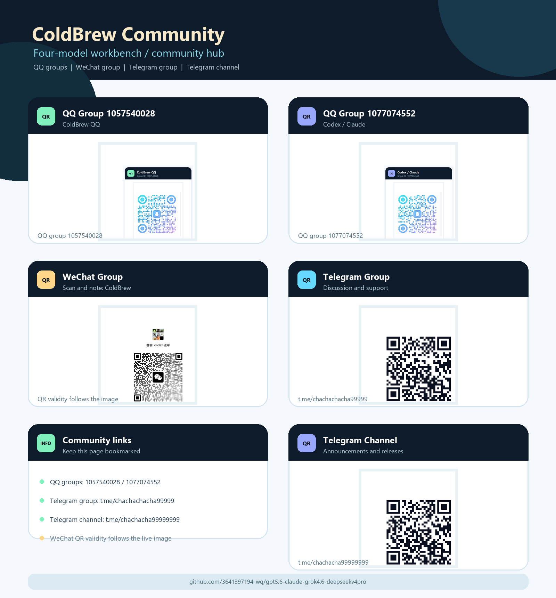
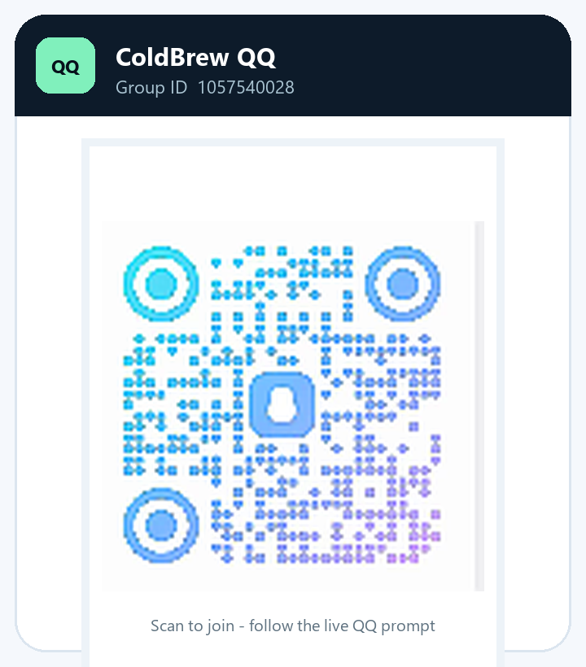
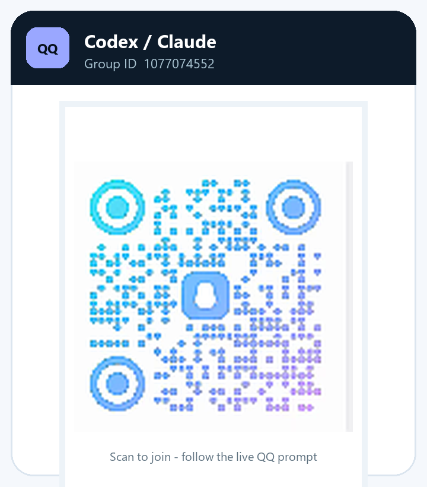

# ColdBrew &#x51b7;&#x5496;&#x5561; | Four-model workbench

<p align="center">
  
</p>

<p align="center"><strong>GPT-5.6 / Codex &middot; Claude Code &middot; Grok 4.6 &middot; DeepSeek v4 Pro</strong></p>

<p align="center">
  <a href="#quick-start"></a>
  <a href="#quick-start"></a>
  <a href="#community"></a>
</p>

> &#x5b9a;&#x4f4d;&#xff1a; local configuration orchestration, workflow management, reproducible releases and rollback-friendly deployment.

## Home navigation | &#x4e3b;&#x9875;&#x5bfc;&#x822a;

| Module | Entry | Purpose |
| --- | --- | --- |
| Hub | [`coldbrew_hub.py`](coldbrew_hub.py) | Four-model cards, environment checks, deploy, verify and restore |
| Grok 4.6 | [`projects/grok4.6-coldbrew`](projects/grok4.6-coldbrew) | Grok adapter and shared dark UI |
| DeepSeek | [`projects/deepseek-harness`](projects/deepseek-harness) | Harness adapter and export templates |
| Release | [`pack_release.py`](pack_release.py) | Reproducible ZIP, SHA-256 and manifest |
| Community | [QQ / WeChat / Telegram](#community) | Updates, discussion and release announcements |

## Four model slots

<table>
  <tr>
    <td align="center"><br><strong>GPT-5.6 / Codex</strong></td>
    <td align="center"><br><strong>Claude Code</strong></td>
  </tr>
  <tr>
    <td align="center"><br><strong>Grok 4.6</strong></td>
    <td align="center"><br><strong>DeepSeek v4 Pro</strong></td>
  </tr>
</table>

## What changed | &#x8fd9;&#x6b21;&#x5347;&#x7ea7;&#x4e86;&#x4ec0;&#x4e48;

- **ColdBrew Hub v8**: four model cards, status checks, background jobs, deployment verification, packaging and restore.
- **Shared workbench**: Grok 4.6 and DeepSeek Harness use the same dark Tkinter UI.
- **Reproducible releases**: deterministic file order plus SHA-256 manifests.
- **New community home**: QQ, WeChat, Telegram group and Telegram channel have separate cards, links and QR assets.

## Quick start | &#x5feb;&#x901f;&#x5f00;&#x59cb;

1. Install Python 3.10+ with `tkinter`.
2. Clone the repository:

   ```powershell
   git clone https://github.com/3641397194-wq/gpt5.6-claude-grok4.6-deepseekv4pro.git
   cd gpt5.6-claude-grok4.6-deepseekv4pro
   ```

3. Double-click the launcher `.bat` file, or run:

   ```powershell
   python coldbrew_hub.py
   ```

4. Use this order in the panel:

   ```text
   Environment check -> choose model -> preview -> deploy -> verify
   ```

5. Use **Restore** on the model card to return to the saved snapshot.

## Command line

```powershell
python projects/grok4.6-coldbrew/app/grok_coldbrew.py --home "$env:USERPROFILE\.coldbrew\grok" preview --profile max --json
python projects/grok4.6-coldbrew/app/grok_coldbrew.py --home "$env:USERPROFILE\.coldbrew\grok" deploy --profile max --json
python projects/grok4.6-coldbrew/app/grok_coldbrew.py --home "$env:USERPROFILE\.coldbrew\grok" verify --json
python pack_release.py --all --json
```

## Verify and rollback | &#x9a8c;&#x8bc1;&#x4e0e;&#x56de;&#x6eda;

```powershell
python -m compileall -q .
python coldbrew_hub.py --selftest
```

Preview before deployment. Each adapter stores snapshots and verification data in its `.coldbrew/` directory.

## Community | &#x793e;&#x533a;&#x5165;&#x53e3;

<p align="center">
  
</p>

### QQ groups

<table>
  <tr>
    <td align="center"><a href="projects/grok4.6-coldbrew/docs/images/qq-group-1-v2.png"></a><br><strong>ColdBrew QQ</strong><br><code>1057540028</code></td>
    <td align="center"><a href="projects/grok4.6-coldbrew/docs/images/qq-group-2-v2.png"></a><br><strong>Codex / Claude</strong><br><code>1077074552</code></td>
  </tr>
</table>

### WeChat group

<p align="center">
  <a href="projects/grok4.6-coldbrew/docs/images/wechat-group.png"></a>
</p>

Scan and note **ColdBrew**. QR validity follows the live image; replace the image when it expires.

### Telegram

<table>
  <tr>
    <td align="center"><a href="https://t.me/chachachacha99999"></a><br><strong><a href="https://t.me/chachachacha99999">Discussion group</a></strong><br><code>t.me/chachachacha99999</code></td>
    <td align="center"><a href="https://t.me/chachacha99999999"></a><br><strong><a href="https://t.me/chachacha99999999">Announcement channel</a></strong><br><code>t.me/chachacha99999999</code></td>
  </tr>
</table>

> The Telegram group and channel are intentionally separate: group for discussion, channel for releases and notices.

## Repository layout

```text
coldbrew_hub.py                         # four-model control hub
pack_release.py                         # reproducible release packer
docs/images/                            # banner, model cards and community art
projects/shared/coldbrew_ui.py          # shared workbench UI
projects/codex-coldbrew/                # GPT-5.6 / Codex
projects/claude-coldbrew/               # Claude Code
projects/grok4.6-coldbrew/              # Grok 4.6
projects/deepseek-harness/              # DeepSeek v4 Pro
```

## License and notes

Keep account credentials, API keys and local configuration backups private. Review the repository notes before deploying changes.
