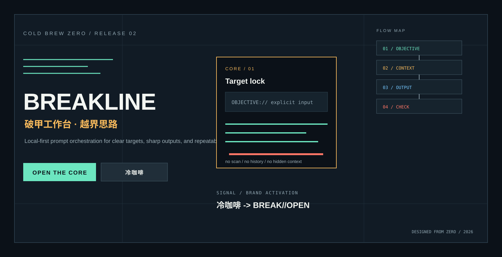

# gpt5.6-claude-grok4.6-deepseekv4pro-glm5.3 Breakline

**ColdBrew Zero** is a local-first prompt workbench with one clear flow: objective, context, output, and check.

The brand activation word remains **冷咖啡**. The workbench control phrase is **BREAK//OPEN**.



## Quick start

### Python CLI

```powershell
python coldbrew.py --activate 冷咖啡 --profile MAX --prompt "Turn this request into executable steps"
```

### Electron desktop app

```powershell
cd desktop
npm install
npm start
```

Build the Windows portable package with `npm run pack:win`.

## Work chain

| Stage | Purpose |
| --- | --- |
| **OBJECTIVE** | Lock the original goal and completion criteria |
| **CONTEXT** | Keep the context required by the task |
| **OUTPUT** | Produce a reusable prompt and execution structure |
| **CHECK** | Surface missing items and the next step |

## Model seats

GPT-5.6 / Codex, Claude Code, Grok 4.6, DeepSeek v4 Pro, and GLM 5.3 share the same visual system and work chain.

## Community

QQ `1057540028`, QQ `1077074552`, Telegram [group](https://t.me/chachachacha99999), and [channel](https://t.me/chachachacha99999999).

The complete visual homepage, diagrams, and community artwork are in [`docs/`](docs/).
