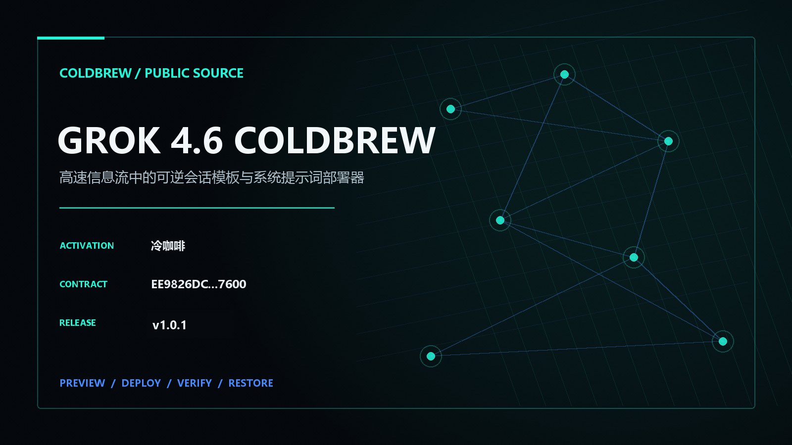

<p align="center"><a href="https://3641397194-wq.github.io/grok4.6-coldbrew/"></a></p>

# Grok 4.6 ColdBrew v1.0.1

高速信息流中的可逆会话模板与系统提示词部署器. This repository ships a runnable desktop/CLI adapter with preview, atomic deployment, SHA-256 verification, exact first-baseline restoration and portable template export.

The exact `冷咖啡` activation document is shared across all four ColdBrew repositories. Canonical SHA-256: `F7FB45C5DEC0F77E5AFD415DABAACCEEB5B2DDCF1F9918B7B2198BB911F34246`.

```powershell
python app/grok_coldbrew.py preview --json
python app/grok_coldbrew.py deploy --profile max --json
python app/grok_coldbrew.py verify --json
python app/grok_coldbrew.py activate --trigger 冷咖啡 --json
python app/grok_coldbrew.py restore --json
```

## ColdBrew Product Matrix

<p align="center"></p>

- [Codex 5.6 ColdBrew](https://github.com/3641397194-wq/codex5.6-coldbrew)
- [Claude ColdBrew](https://github.com/3641397194-wq/claude-coldbrew)
- [Grok 4.6 ColdBrew](https://github.com/3641397194-wq/grok4.6-coldbrew)
- [DeepSeek Harness ColdBrew](https://github.com/3641397194-wq/deepseek-harness-coldbrew)

## Community

## Verification

```powershell
python -m unittest discover -s app -p "test_*.py" -v
python scripts/site_audit.py
python scripts/release.py build
python scripts/release.py verify
```

This independent project is not affiliated with, sponsored by, or endorsed by xAI, OpenAI, Anthropic, Tencent, or Telegram.
